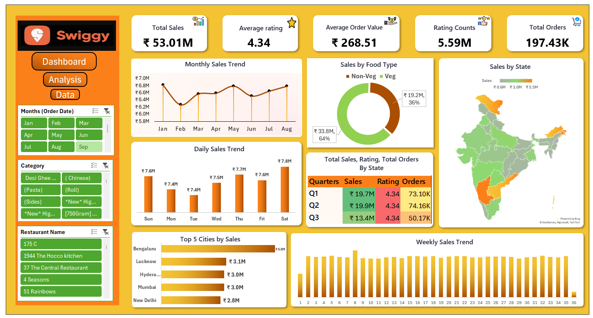

# Swiggy Sales Dashboard – Excel

An interactive Excel dashboard analyzing Swiggy order data across India, built with PivotTables, PivotCharts, slicers, and a custom-designed dashboard layout.



## 📊 Overview

This dashboard tracks Swiggy's sales performance across time, geography, food type, and city, with interactive filters for Month, Category, and Restaurant Name.

**Key Metrics**
| Metric | Value |
|---|---|
| Total Sales | ₹53.01M |
| Average Order Value | ₹268.51 |
| Total Orders | 197.43K |
| Average Rating | 4.34 |
| Rating Counts | 5.59M |

## 🔍 What the Dashboard Shows

- **Monthly & Weekly Sales Trend** – seasonality and week-over-week movement
- **Daily Sales Trend** – sales performance by day of week
- **Sales by Food Type** – Veg (64%) vs Non-Veg (36%) split
- **Sales by State** – choropleth map of India showing sales concentration by state
- **Top 5 Cities by Sales** – Bengaluru, Lucknow, Hyderabad, Mumbai, New Delhi
- **Quarterly Breakdown** – Sales, Rating, and Orders by quarter (Q1–Q3)
- **Interactive Slicers** – filter the whole dashboard by Month, Category, and Restaurant Name

## 🛠️ Tools & Techniques Used

- Microsoft Excel (PivotTables & PivotCharts)
- Data cleaning and transformation on raw order-level data
- Slicers for interactive filtering
- Map chart for state-wise sales visualization
- Custom dashboard design (KPI cards, donut chart, bar/line charts)

## 📁 Repository Structure

```
swiggy-sales-dashboard/
├── README.md
├── Swiggy_Sales_Dashboard.png          # Dashboard preview image
├── Swiggy_Raw_Data_Excel.xlsx          # Raw/source order data
└── Swiggy_complete_dashboard_Excel.xlsx # Final workbook (Pivot table + Dashboard + Data)
```

## 🚀 How to Use

1. Download `Swiggy_complete_dashboard_Excel.xlsx`
2. Open in Microsoft Excel (2016 or later recommended for full slicer/map chart support)
3. Use the slicers on the **Dashboard** sheet to filter by Month, Category, or Restaurant
4. Explore the **Pivot table** sheet to see how each visual is built

## 📌 Key Insights

- Non-Veg orders generate 36% of sales despite Veg being the larger category by volume
- Bengaluru is the top-performing city, contributing ₹5.5M in sales
- Sales dipped in February and picked up steadily from March through August
- Rating stayed consistently high (4.34) across all three quarters, indicating stable customer satisfaction despite sales fluctuations

## 👤 Author

**Divya Gupta**
Aspiring Data Analyst | Python, SQL, Power BI, Excel
GitHub: [@divyainsights99](https://github.com/divyainsights99)
